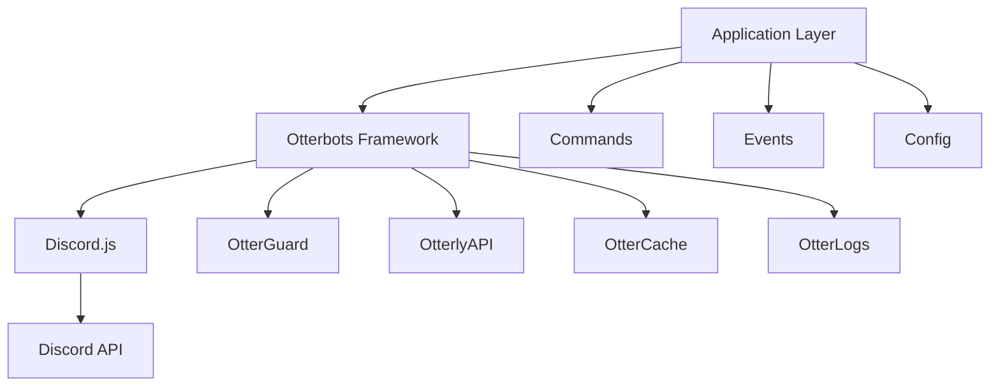

<div align="center">


# 🦦 Arisoutre

### Bot Discord de modération pour L'Antre des Loutres

[](https://github.com/L-Antre-des-Loutres/Otterbots)
[](../../Antigravity/Arisoutre/LICENSE)
[](https://discord.js.org/)
[](https://www.typescriptlang.org/)
[](https://nodejs.org/)

[Fonctionnalités](#-fonctionnalités) •
[Installation](#-installation-rapide) •
[Documentation](#-documentation) •
[Configuration](#%EF%B8%8F-configuration) •
[Contribution](#-contribution)

---

### 🎯 Un bot Discord moderne et puissant pour la modération et la gestion de communauté

</div>

---

## 📋 À propos

**Arisoutre** est un bot Discord de modération développé en TypeScript pour le serveur "L'Antre des Loutres". Il offre un système de protection avancé (OtterGuard), une intégration API complète (OtterlyAPI), et une architecture modulaire extensible.

### ✨ Points forts

- 🛡️ **Système de protection multi-couches** avec OtterGuard
- 🚀 **Architecture modulaire** séparant framework et logique métier
- 📊 **Intégration API** pour la persistance des données
- 🎨 **Embeds personnalisables** et messages de bienvenue
- ⚡ **Performances optimisées** avec système de cache
- 📝 **Logs avancés** avec support Discord webhooks
- ⏰ **Tâches planifiées** avec node-cron
- 🔧 **Configuration flexible** via variables d'environnement

---

## 🚀 Fonctionnalités

### 🛡️ OtterGuard - Système de protection

- **Protection contre les liens** : Filtre les liens non autorisés avec liste blanche configurable
- **Protection anti-scam** : Détecte et bloque les tentatives de phishing
- **Protection anti-spam** : Limite les messages répétitifs et le flood
- **Logs automatiques** : Enregistre toutes les actions dans le canal de modération

### 💬 Commandes slash

| Commande | Description | Permissions |
|----------|-------------|-------------|
| `/analyze` | Analyse le score de fiabilité d'un membre | Admin |
| `/clear` | Supprime des messages en masse (1-100) | Admin |
| `/git-repo` | Affiche les informations du repository | Tous |

### 📢 Événements automatiques

- **Bienvenue** : Message personnalisé pour les nouveaux membres
- **Au revoir** : Notification lors du départ d'un membre
- **Logs de messages** : Suivi des suppressions et modifications
- **Statistiques vocales** : Suivi de l'activité dans les salons vocaux
- **Comptage de messages** : Système de statistiques et de classement

### 🔌 API Otterly

- Client HTTP intégré pour communication avec API externe
- Cache local des routes pour performances optimales
- Support GET, POST, PUT avec gestion d'erreurs
- Types TypeScript pour sécurité du code

### 📊 Système de logs

- **Console** : Logs colorés avec pino-pretty
- **Discord** : Webhooks pour logs critiques
- **Niveaux** : debug, info, success, warn, error
- **Configuration** : Activation sélective par niveau

---

## 🔧 Installation rapide

### Prérequis

- Node.js 18+ et npm 8+
- Un bot Discord créé sur le [Developer Portal](https://discord.com/developers/applications)
- Un serveur Discord avec permissions administrateur

### Installation

```bash
# Cloner le repository
git clone https://github.com/L-Antre-des-Loutres/Otterbots.git
cd Otterbots

# Installer les dépendances
npm install

# Configurer l'environnement
cp .env.example .env
# Éditer .env avec vos valeurs

# Compiler et lancer
npm run dev
```

### Configuration minimale (.env)

```env
BOT_TOKEN=votre_token_discord
DISCORD_CLIENT_ID=votre_client_id
DISCORD_GUILD_ID=votre_guild_id
MODERATION_CHANNEL_ID=votre_channel_id
```

📖 **Guide complet** : [docs/INSTALLATION.md](../../Antigravity/Arisoutre/docs/INSTALLATION.md)

---

## 📚 Documentation

### Guides principaux

| Document | Description |
|----------|-------------|
| [📐 ARCHITECTURE.md](../../Antigravity/Arisoutre/docs/ARCHITECTURE.md) | Architecture du projet et structure des modules |
| [🔧 INSTALLATION.md](../../Antigravity/Arisoutre/docs/INSTALLATION.md) | Guide d'installation pas à pas |
| [⚙️ CONFIGURATION.md](../../Antigravity/Arisoutre/docs/CONFIGURATION.md) | Configuration détaillée et variables d'environnement |
| [💻 COMMANDS.md](../../Antigravity/Arisoutre/docs/COMMANDS.md) | Documentation des commandes et création de nouvelles commandes |
| [📡 EVENTS.md](../../Antigravity/Arisoutre/docs/EVENTS.md) | Événements Discord et création d'événements personnalisés |
| [🔌 API.md](../../Antigravity/Arisoutre/docs/API.md) | Utilisation du module OtterlyAPI |
| [👨‍💻 DEVELOPMENT.md](../../Antigravity/Arisoutre/docs/DEVELOPMENT.md) | Guide de développement et bonnes pratiques |

---

## ⚙️ Configuration

### Structure du projet

```
Arisoutre/
├── src/
│   ├── app/              # Logique métier
│   │   ├── commands/    # Commandes personnalisées
│   │   ├── config/      # Configuration
│   │   ├── embeds/      # Templates d'embeds
│   │   ├── events/      # Événements
│   │   └── utils/       # Utilitaires
│   │
│   └── otterbots/       # Framework réutilisable
│       ├── handlers/    # Gestionnaires
│       ├── utils/       # Utilitaires framework
│       │   ├── otterguard/   # Système de protection
│       │   ├── otterlyapi/   # Client API
│       │   └── ottercache/   # Système de cache
│       └── ...
│
├── docs/                # Documentation
├── config/              # Configuration externe
└── build/               # Fichiers compilés
```

### Configuration d'OtterGuard

```typescript
// src/app/config/otterguardConfig.ts
export const otterguardConfig = {
    protectLink: true,    // Protection liens
    protectScam: true,    // Protection scam
    protectSpam: true,    // Protection spam
};

export const authorizedDomains = [
    "https://discord.com",
    "https://youtube.com",
    // Vos domaines...
];
```

---

## 🛠️ Développement

### Scripts disponibles

```bash
npm run dev      # Développement (lint + build + start)
npm run build    # Compilation TypeScript
npm run lint     # Vérification ESLint
npm start        # Lancer le bot compilé
```

### Créer une commande

```typescript
// src/app/commands/maCommande.ts
import { SlashCommandBuilder, ChatInputCommandInteraction } from "discord.js";

export default {
    data: new SlashCommandBuilder()
        .setName("macommande")
        .setDescription("Ma nouvelle commande"),
    
    async execute(interaction: ChatInputCommandInteraction): Promise<void> {
        await interaction.reply("Hello World!");
    }
};
```

### Créer un événement

```typescript
// src/app/events/MonEvenement.ts
import { Events, Message } from "discord.js";

export default {
    name: Events.MessageCreate,
    once: false,
    async execute(message: Message) {
        console.log(`Message de ${message.author.tag}`);
    }
};
```

📖 **Guide complet** : [docs/DEVELOPMENT.md](../../Antigravity/Arisoutre/docs/DEVELOPMENT.md)

---

## 🏗️ Architecture

Arisoutre utilise une architecture en couches :



- **Application Layer** : Logique métier spécifique au serveur
- **Otterbots Framework** : Framework réutilisable pour bots Discord
- **Modules** : OtterGuard, OtterlyAPI, OtterCache, OtterLogs

📖 **Détails** : [docs/ARCHITECTURE.md](../../Antigravity/Arisoutre/docs/ARCHITECTURE.md)

---

## 🤝 Contribution

Les contributions sont les bienvenues ! Voici comment contribuer :

1. **Fork** le projet
2. Créez votre branche (`git checkout -b feature/AmazingFeature`)
3. Committez vos changements (`git commit -m 'feat: add amazing feature'`)
4. Pushez vers la branche (`git push origin feature/AmazingFeature`)
5. Ouvrez une **Pull Request**

---

## 📄 License

Ce projet est sous licence MIT. Voir le fichier [LICENSE](../../Antigravity/Arisoutre/LICENSE) pour plus de détails.

---

## 👥 Auteurs

- **Antre des Loutres** - [GitHub](https://github.com/L-Antre-des-Loutres)

---

## Modules utilisés

- [Discord.js](https://discord.js.org/) - Framework Discord pour Node.js
- [TypeScript](https://www.typescriptlang.org/) - Langage de programmation
- [Pino](https://getpino.io/) - Système de logs
- [Axios](https://axios-http.com/) - Client HTTP
- [node-cron](https://github.com/node-cron/node-cron) - Planificateur de tâches

---

## 📞 Support

- 📖 [Documentation complète](docs/)
- 🐛 [Signaler un bug](https://github.com/L-Antre-des-Loutres/Arisoutre/issues)
- 💡 [Proposer une fonctionnalité](https://github.com/L-Antre-des-Loutres/Arisoutre/issues)

---

<div align="center">

**Fait avec ❤️ par L'Antre des Loutres**

⭐ N'oubliez pas de mettre une étoile si ce projet vous plaît !

</div>