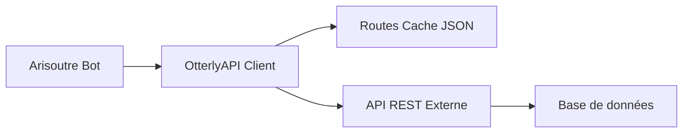

# API Otterly - Arisoutre

## Vue d'ensemble

Le module **OtterlyAPI** est un client HTTP qui permet à Arisoutre de communiquer avec une API REST externe. Il gère automatiquement le chargement des routes, la mise en cache, et fournit des méthodes simples pour effectuer des requêtes GET, POST et PUT.

## Architecture



## Initialisation

### Configuration

Dans votre fichier `.env` :

```env
API_ROUTES_URL=https://otterlyapi.antredesloutres.fr/api/routes
API_TOKEN=votre_token_api
```

### Démarrage

L'API est initialisée automatiquement au démarrage du bot :

```typescript
// src/otterbots/index.ts
private initOtterlyApiModule() {
    const otterlyApiModule = new Otterlyapi();
    otterlyApiModule.init();
}
```

## Classe Otterlyapi

### Méthodes principales

#### `init()`

Initialise le module en chargeant les routes depuis l'API.

```typescript
const api = new Otterlyapi();
await api.init();
```

**Fonctionnement :**
1. Télécharge la configuration des routes depuis `API_ROUTES_URL`
2. Enregistre les routes dans `otterlyApiRoutes.json`
3. Log le succès ou l'échec de l'opération

---

#### `getDataByAlias<T>(alias: string, param?: string)`

Effectue une requête GET pour récupérer des données.

**Paramètres :**
- `alias` : Alias de la route (défini dans la configuration)
- `param` : Paramètre optionnel à ajouter à l'URL

**Retour :**
- `Promise<T | undefined>` : Les données récupérées ou `undefined` en cas d'erreur

**Exemple :**
```typescript
// Récupérer tous les utilisateurs
const users = await api.getDataByAlias<User[]>("users");

// Récupérer un utilisateur spécifique
const user = await api.getDataByAlias<User>("user", "123");
```

---

#### `postDataByAlias<T>(alias: string, data: T)`

Effectue une requête POST pour créer des données.

**Paramètres :**
- `alias` : Alias de la route
- `data` : Données à envoyer dans le corps de la requête

**Retour :**
- `Promise<T | undefined>` : Les données créées ou `undefined` en cas d'erreur

**Exemple :**
```typescript
const newUser = {
    name: "Jean",
    discordId: "123456789"
};

const createdUser = await api.postDataByAlias<User>("createUser", newUser);
```

---

#### `putDataByAlias<T>(alias: string, data: T)`

Effectue une requête PUT pour mettre à jour des données.

**Paramètres :**
- `alias` : Alias de la route
- `data` : Données à envoyer pour la mise à jour

**Retour :**
- `Promise<T | undefined>` : Les données mises à jour ou `undefined` en cas d'erreur

**Exemple :**
```typescript
const updatedUser = {
    id: "123",
    name: "Jean Dupont",
    discordId: "123456789"
};

const result = await api.putDataByAlias<User>("updateUser", updatedUser);
```

---

## Configuration des routes

### Format du fichier JSON

Le fichier `otterlyApiRoutes.json` contient la configuration des routes :

```json
{
  "routes": [
    {
      "alias": "users",
      "url": "https://api.example.com/users",
      "method": "GET",
      "description": "Récupérer tous les utilisateurs"
    },
    {
      "alias": "user",
      "url": "https://api.example.com/users/{param}",
      "method": "GET",
      "description": "Récupérer un utilisateur par ID"
    },
    {
      "alias": "createUser",
      "url": "https://api.example.com/users",
      "method": "POST",
      "description": "Créer un nouvel utilisateur"
    },
    {
      "alias": "updateUser",
      "url": "https://api.example.com/users/{param}",
      "method": "PUT",
      "description": "Mettre à jour un utilisateur"
    }
  ]
}
```

### Type RoutesType

```typescript
export type RoutesType = {
    alias: string;
    url: string;
    method: "GET" | "POST" | "PUT" | "DELETE";
    description?: string;
};
```

## Utilisation pratique

### Exemple : Enregistrer un membre

```typescript
import { Otterlyapi } from "../otterbots/utils/otterlyapi/otterlyapi";

async function registerMember(member: GuildMember) {
    const api = new Otterlyapi();
    
    const userData = {
        discordId: member.id,
        username: member.user.username,
        discriminator: member.user.discriminator,
        joinedAt: member.joinedAt,
        avatar: member.user.displayAvatarURL()
    };

    try {
        const result = await api.postDataByAlias("registerMember", userData);
        
        if (result) {
            console.log("Membre enregistré avec succès:", result);
        } else {
            console.error("Échec de l'enregistrement du membre");
        }
    } catch (error) {
        console.error("Erreur lors de l'enregistrement:", error);
    }
}
```

### Exemple : Récupérer les statistiques d'un membre

```typescript
async function getMemberStats(discordId: string) {
    const api = new Otterlyapi();
    
    try {
        const stats = await api.getDataByAlias<MemberStats>(
            "memberStats", 
            discordId
        );
        
        if (stats) {
            return {
                messages: stats.messageCount,
                voiceTime: stats.voiceMinutes,
                level: stats.level
            };
        }
    } catch (error) {
        console.error("Erreur lors de la récupération des stats:", error);
    }
    
    return null;
}
```

### Exemple : Mettre à jour le niveau d'un membre

```typescript
async function updateMemberLevel(discordId: string, newLevel: number) {
    const api = new Otterlyapi();
    
    const updateData = {
        discordId: discordId,
        level: newLevel,
        updatedAt: new Date()
    };

    try {
        const result = await api.putDataByAlias("updateMemberLevel", updateData);
        
        if (result) {
            console.log(`Niveau mis à jour pour ${discordId}: ${newLevel}`);
            return true;
        }
    } catch (error) {
        console.error("Erreur lors de la mise à jour du niveau:", error);
    }
    
    return false;
}
```

## Gestion des erreurs

### Codes de statut HTTP

Le module gère automatiquement les codes de statut HTTP :

```typescript
validateStatus(status) {
    return status >= 200 && status < 300; // Accepte 2xx
}
```

### Gestion personnalisée

```typescript
async function safeApiCall<T>(
    alias: string, 
    data?: any
): Promise<T | null> {
    const api = new Otterlyapi();
    
    try {
        let result;
        
        if (data) {
            result = await api.postDataByAlias<T>(alias, data);
        } else {
            result = await api.getDataByAlias<T>(alias);
        }
        
        if (!result) {
            console.warn(`Aucune donnée retournée pour ${alias}`);
            return null;
        }
        
        return result;
    } catch (error) {
        console.error(`Erreur API pour ${alias}:`, error);
        return null;
    }
}
```

## Types TypeScript

### Définir vos types de données

```typescript
// src/app/types/ApiTypes.ts

export interface User {
    id: string;
    discordId: string;
    username: string;
    discriminator: string;
    avatar?: string;
    createdAt: Date;
}

export interface MemberStats {
    discordId: string;
    messageCount: number;
    voiceMinutes: number;
    level: number;
    xp: number;
}

export interface ServerConfig {
    guildId: string;
    prefix: string;
    language: string;
    features: {
        leveling: boolean;
        moderation: boolean;
        welcome: boolean;
    };
}
```

### Utilisation avec typage

```typescript
import { User, MemberStats } from "../types/ApiTypes";

const api = new Otterlyapi();

// TypeScript connaît le type de retour
const user: User | undefined = await api.getDataByAlias<User>("user", "123");

if (user) {
    console.log(user.username); // ✅ Autocomplétion
    console.log(user.invalidProp); // ❌ Erreur TypeScript
}
```

## Authentification

### Token d'API

Si votre API nécessite un token d'authentification :

```typescript
// Modifiez la méthode dans otterlyapi.ts
const headers = {
    "Content-Type": "application/json",
    "Authorization": `Bearer ${process.env.API_TOKEN}`
};

const response = await axios.get(url, { headers });
```

### Headers personnalisés

```typescript
const config = {
    headers: {
        "Content-Type": "application/json",
        "Authorization": `Bearer ${process.env.API_TOKEN}`,
        "X-Custom-Header": "value"
    }
};

const response = await axios.post(url, data, config);
```

## Mise en cache

### Cache local

Les routes sont mises en cache dans `otterlyApiRoutes.json` pour :
- Réduire les appels API au démarrage
- Fonctionner hors ligne (avec les routes en cache)
- Améliorer les performances

### Rafraîchir le cache

Pour rafraîchir le cache des routes :

```typescript
const api = new Otterlyapi();
await api.registerRoutesInJsonFile();
```

### Tâche planifiée de rafraîchissement

```typescript
// src/app/config/task.ts
import cron from "node-cron";
import { Otterlyapi } from "../../otterbots/utils/otterlyapi/otterlyapi";

// Rafraîchir les routes toutes les 24 heures
cron.schedule('0 0 * * *', async () => {
    const api = new Otterlyapi();
    await api.registerRoutesInJsonFile();
    console.log("Routes API rafraîchies");
});
```

## Bonnes pratiques

### 1. Gestion des erreurs

Toujours gérer les cas où l'API ne répond pas :

```typescript
const data = await api.getDataByAlias<User>("user", userId);

if (!data) {
    // Gérer le cas d'erreur
    await interaction.reply("Impossible de récupérer les données.");
    return;
}

// Utiliser les données
console.log(data.username);
```

### 2. Typage strict

Définir des interfaces pour tous vos types de données :

```typescript
interface ApiResponse<T> {
    success: boolean;
    data?: T;
    error?: string;
}

const response = await api.getDataByAlias<ApiResponse<User>>("user", "123");
```

### 3. Retry logic

Implémenter une logique de retry pour les requêtes échouées :

```typescript
async function apiCallWithRetry<T>(
    alias: string,
    maxRetries: number = 3
): Promise<T | null> {
    const api = new Otterlyapi();
    
    for (let i = 0; i < maxRetries; i++) {
        try {
            const result = await api.getDataByAlias<T>(alias);
            if (result) return result;
        } catch (error) {
            console.warn(`Tentative ${i + 1}/${maxRetries} échouée`);
            if (i === maxRetries - 1) throw error;
            await new Promise(resolve => setTimeout(resolve, 1000 * (i + 1)));
        }
    }
    
    return null;
}
```

### 4. Validation des données

Valider les données avant de les envoyer :

```typescript
function isValidUser(data: any): data is User {
    return (
        typeof data.discordId === "string" &&
        typeof data.username === "string" &&
        data.discordId.length > 0
    );
}

if (isValidUser(userData)) {
    await api.postDataByAlias("createUser", userData);
} else {
    console.error("Données utilisateur invalides");
}
```

## Dépannage

### L'API ne répond pas

1. Vérifiez que `API_ROUTES_URL` est correct dans `.env`
2. Vérifiez que l'API externe est accessible
3. Vérifiez les logs pour les erreurs réseau

### Routes non trouvées

1. Vérifiez que `otterlyApiRoutes.json` existe
2. Vérifiez que l'alias est correct
3. Rafraîchissez le cache des routes

### Erreurs d'authentification

1. Vérifiez que `API_TOKEN` est défini
2. Vérifiez que le token est valide
3. Vérifiez les headers d'authentification

## Ressources

- [Documentation Axios](https://axios-http.com/docs/intro)
- [API REST Best Practices](https://restfulapi.net/)
- [TypeScript Handbook](https://www.typescriptlang.org/docs/)
