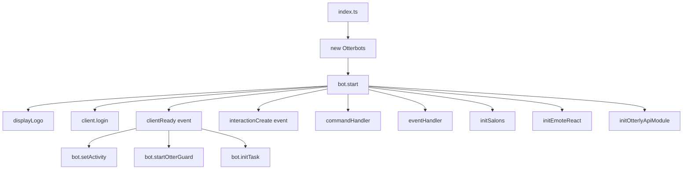

# Architecture d'Arisoutre

## Vue d'ensemble

Arisoutre est un bot Discord de modération développé en TypeScript utilisant Discord.js v14. Le projet suit une architecture modulaire séparant les préoccupations entre la logique métier (application) et le framework du bot (Otterbots).

## Structure du projet

```
Arisoutre/
├── src/
│   ├── app/                    # Logique métier de l'application
│   │   ├── commands/          # Commandes slash spécifiques
│   │   ├── config/            # Fichiers de configuration
│   │   ├── embeds/            # Templates d'embeds Discord
│   │   ├── events/            # Gestionnaires d'événements Discord
│   │   ├── tasks/             # Tâches planifiées (cron)
│   │   ├── types/             # Types TypeScript
│   │   └── utils/             # Utilitaires métier
│   │
│   └── otterbots/             # Framework du bot
│       ├── commands/          # Commandes du framework
│       ├── events/            # Événements du framework
│       ├── handlers/          # Gestionnaires de commandes/événements
│       ├── types/             # Types du framework
│       └── utils/             # Utilitaires du framework
│           ├── ottercache/    # Système de cache
│           ├── otterguard/    # Système de protection
│           └── otterlyapi/    # Client API
│
├── config/                     # Configuration externe
├── build/                      # Fichiers compilés (généré)
└── docs/                       # Documentation

```

## Architecture en couches

### 1. Couche Application (`src/app/`)

Cette couche contient la logique métier spécifique au serveur Discord "L'Antre des Loutres".

#### Composants principaux :

- **Commands** : Commandes slash personnalisées
  - `analyze.ts` : Analyse le score de fiabilité d'un membre
  - `clear.ts` : Suppression de messages

- **Events** : Gestionnaires d'événements Discord
  - `GuildMemberAdd.ts` : Accueil des nouveaux membres
  - `GuildMemberRemove.ts` : Départ de membres
  - `MessageCount.ts` : Comptage de messages
  - `OnMessageDelete.ts` : Logs de suppression
  - `OnMessageUpdate.ts` : Logs de modification
  - `voiceStateUpdate.ts` : Gestion des salons vocaux

- **Tasks** : Tâches planifiées avec node-cron
  - `cacheRegister.ts` : Mise à jour du cache
  - `registerAllMember.ts` : Enregistrement des membres

- **Config** : Configuration de l'application
  - `client.ts` : Configuration du client Discord
  - `otterguardConfig.ts` : Configuration de la protection
  - `salon.ts` : Configuration des salons
  - `task.ts` : Configuration des tâches cron
  - `emojiReact.ts` : Configuration des réactions emoji
  - `cache.ts` : Configuration du cache

### 2. Couche Framework (`src/otterbots/`)

Framework réutilisable pour créer des bots Discord avec des fonctionnalités avancées.

#### Classe principale : `Otterbots`

La classe `Otterbots` est le point d'entrée du framework. Elle orchestre :

```typescript
export class Otterbots {
    private client: Client;
    
    // Méthodes publiques
    public start(): void
    public getClient(): Client
    public setActivity(activityType: string, activity: string): void
    public async purgeCommand(client?: Client): Promise<void>
    public startOtterGuard(client?: Client): void
    public initTask(ifTaskOnStart?: boolean): void
}
```

#### Modules du framework :

##### **OtterGuard** - Système de protection
Module de sécurité multi-couches :
- **Protection contre les liens** : Filtre les liens non autorisés
- **Protection anti-scam** : Détecte les tentatives de phishing
- **Protection anti-spam** : Limite les messages répétitifs

Configuration dans `otterguardConfig.ts` :
```typescript
export const otterguardConfig = {
    protectLink: true,
    protectScam: true,
    protectSpam: true,
};
```

##### **OtterlyAPI** - Client API
Client HTTP pour communiquer avec l'API externe :
- Enregistrement des routes depuis l'API
- Méthodes GET, POST, PUT
- Gestion du cache des routes
- Validation des statuts HTTP

##### **OtterCache** - Système de cache
Système de mise en cache pour optimiser les performances.

##### **OtterLogs** - Système de logs
Système de journalisation basé sur Pino :
- Logs console avec pino-pretty
- Logs Discord via webhooks (optionnel)
- Niveaux : success, debug, info, warn, error

#### Handlers :

##### **CommandHandler**
- Chargement automatique des commandes depuis `src/app/commands/` et `src/otterbots/commands/`
- Enregistrement des commandes slash sur Discord
- Support des sous-dossiers
- Validation des commandes

##### **EventHandler**
- Chargement automatique des événements depuis `src/app/events/`
- Support des événements `once` et `on`
- Gestion des erreurs par événement

## Flux de démarrage



## Gestion des commandes

### Cycle de vie d'une commande slash

1. **Définition** : Création du fichier de commande avec `SlashCommandBuilder`
2. **Chargement** : Le `commandHandler` scanne les dossiers de commandes
3. **Enregistrement** : Les commandes sont envoyées à l'API Discord
4. **Exécution** : L'événement `interactionCreate` route vers la méthode `execute()`

### Structure d'une commande

```typescript
import { SlashCommandBuilder, ChatInputCommandInteraction } from "discord.js";

export default {
    data: new SlashCommandBuilder()
        .setName("nom")
        .setDescription("Description"),
    
    async execute(interaction: ChatInputCommandInteraction): Promise<void> {
        // Logique de la commande
    }
};
```

## Gestion des événements

### Cycle de vie d'un événement

1. **Définition** : Création du fichier d'événement
2. **Chargement** : L'`eventHandler` charge tous les événements
3. **Enregistrement** : Attachement via `client.on()` ou `client.once()`
4. **Exécution** : Déclenchement automatique par Discord.js

### Structure d'un événement

```typescript
export default {
    name: "eventName",
    once: false, // ou true pour un événement unique
    async execute(...args) {
        // Logique de l'événement
    }
};
```

## Système de tâches planifiées

Les tâches utilisent `node-cron` pour exécuter du code à intervalles réguliers.

Configuration dans `src/app/config/task.ts` :
```typescript
export function taskOnStart() {
    // Tâches à exécuter au démarrage
}
```

Initialisation :
```typescript
bot.initTask(true); // true = exécuter au démarrage
```

## Système de logs

### OtterLogs

Basé sur Pino avec support de webhooks Discord :

```typescript
import { otterlogs } from "./otterbots/utils/otterlogs";

otterlogs.success("Message de succès");
otterlogs.debug("Message de debug");
otterlogs.info("Message d'information");
otterlogs.warn("Message d'avertissement");
otterlogs.error("Message d'erreur");
```

Configuration via variables d'environnement :
- `ENABLE_DISCORD_SUCCESS` : Logs de succès vers Discord
- `ENABLE_DISCORD_LOGS` : Logs généraux vers Discord
- `ENABLE_DISCORD_WARNS` : Avertissements vers Discord
- `ENABLE_DISCORD_ERRORS` : Erreurs vers Discord
- `GLOBAL_WEBHOOK_URL` : Webhook pour logs généraux
- `ERROR_WEBHOOK_URL` : Webhook pour erreurs

## Intégration avec l'API externe

Le module `OtterlyAPI` permet de communiquer avec une API REST externe.

### Fonctionnalités :

1. **Enregistrement des routes** : Télécharge la configuration des routes depuis l'API
2. **Cache local** : Stocke les routes dans `otterlyApiRoutes.json`
3. **Méthodes HTTP** : GET, POST, PUT avec gestion d'erreurs
4. **Alias de routes** : Accès simplifié via des alias

### Utilisation :

```typescript
const api = new Otterlyapi();
await api.init();

// GET
const data = await api.getDataByAlias<Type>("alias");

// POST
const result = await api.postDataByAlias<Type>("alias", data);

// PUT
const updated = await api.putDataByAlias<Type>("alias", data);
```

## Sécurité et modération

### OtterGuard

Système de protection en temps réel :

#### 1. Protection contre les liens
- Liste blanche de domaines autorisés
- Suppression automatique des liens non autorisés
- Notification dans le canal de modération

#### 2. Protection anti-scam
- Détection de patterns de phishing
- Analyse des messages suspects
- Actions automatiques

#### 3. Protection anti-spam
- Détection de messages répétitifs
- Limitation du taux de messages
- Sanctions progressives

## Types et interfaces

### Types principaux

```typescript
// SlashCommand
interface SlashCommand {
    data: SlashCommandBuilder;
    execute: (interaction: ChatInputCommandInteraction) => Promise<void>;
}

// Client étendu
interface ExtendedClient extends Client {
    slashCommands: Collection<string, SlashCommand>;
}
```

## Gestion de la configuration

La configuration est gérée via :

1. **Variables d'environnement** (`.env`)
2. **Fichiers de configuration** (`src/app/config/`)
3. **Configuration du framework** (`src/otterbots/`)

### Séparation des préoccupations :
- Configuration métier → `src/app/config/`
- Configuration framework → `src/otterbots/`
- Secrets et tokens → `.env`

## Compilation et exécution

### Développement
```bash
npm run dev
```
Exécute : lint → build → start

### Production
```bash
npm run build  # Compile TypeScript
npm start      # Lance le bot compilé
```

Le code TypeScript est compilé dans le dossier `build/` selon la configuration de `tsconfig.json`.

## Extensibilité

Le framework Otterbots est conçu pour être réutilisable :

1. **Séparation claire** : `app/` vs `otterbots/`
2. **Handlers automatiques** : Chargement dynamique des commandes/événements
3. **Configuration externalisée** : Facile à adapter
4. **Modules indépendants** : OtterGuard, OtterlyAPI, OtterCache

Pour créer un nouveau bot :
1. Copier le dossier `otterbots/`
2. Créer un nouveau dossier `app/` avec votre logique
3. Configurer les variables d'environnement
4. Lancer avec `new Otterbots().start()`
